# External RDB Rhythm Reconstruction Gallery & Comprehensive 12-Model Failure Mode Analysis

**Cohort Provenance**: Chinese Cardiologist-Annotated Subset of the Chapman-Shaoxing Database (*Zheng et al., Scientific Data 2020*, Shaoxing People's Hospital, Zhejiang, China / Chapman University).  
**Test Set Scale**: $N = 360$ frozen, patient-disjoint 12-lead ECG records ($10.0\text{ seconds}$ at $500\text{ Hz}$, $5,000\text{ samples/lead}$, preserved in raw physical millivolts).  
**Evaluation Scope**: Deep-dive failure analysis across all **12 models of the 15-Epoch Convergence Cohort (`conv15e_*`)**, all **12 ECG leads**, and all **8 canonical clinical rhythms** ($N=360$).

---

## 1. Executive Summary & Biophysical Landscape

Single-lead ECG reconstruction models attempt to recover all 11 missing clinical leads ($\text{II}, \text{III}, a\text{VR}, a\text{VL}, a\text{VF}, V_1\text{--}V_6$) from a single horizontal limb vector (Lead I: Left Arm $-$ Right Arm, $\mathbf{c}_I = [1, 0, 0]^T$). While aggregate benchmark metrics appear strong on standard evaluation folds ($\bar{r} \approx 0.746$ on PTB-XL, boundary $F_1 \approx 0.723$ on RDB), these broad summary metrics conceal **critical, biophysically determined failure modes**.

When examined lead-by-lead, model-by-model, and rhythm-by-rhythm, the reconstruction fidelity is governed by **Maxwellian volume conduction constraints and lead field geometry**, rather than by the choice of neural network backbone. Regardless of whether models employ pure axial Transformers, multi-scale analytic Morlet wavelets, self-supervised BYOL projections, or auxiliary multi-task delineation heads, they universally confront an unyielding physical reality: **information orthogonal to the observed lead axis cannot be synthesized without prior population bias**.

```
                             OBSERVED LEAD I INPUT: Φ_I(t) = px(t)
                                              │
              ┌───────────────────────────────┴───────────────────────────────┐
              ▼                                                               ▼
  FRONTAL NULL SPACE COLLAPSE (LEADS II, III, aVF)             PRECORDIAL PROGRESSION DISSOCIATION
              │                                                               │
  Inner Product: c_I · c_aVF = 0                              Z-Axis Blindness: c_I ⊥ pz(t)
  Vertical dipole py(t) is completely unconstrained;          Early precordial septal forces (V1, V2)
  Models revert to normal-axis prior (+60°);                  and lateral chest forces (V5, V6) track reasonably,
  Leftward / horizontal axes result in negative correlations  but the transitional zone (V3) experiences
  (e.g., r_aVF = -0.429 in SR0234, -0.375 in AFIB0293).       a persistent local minimum (V3 saddle point).
```

### Summary Performance Across All 8 Canonical Rhythms ($N = 360$)

The table below summarizes the reconstruction performance of the primary benchmark architecture (`conv15e_A0_raw`) across all 360 held-out test records, grouped by clinical rhythm:

| Canonical Rhythm | Clinical Name | Test Count ($N$) | Mean Missing $r$ | SD | Minimum $r$ (Worst) | Median $r$ | Maximum $r$ (Best) | Clinical Difficulty Rating |
|:---|:---|:---:|:---:|:---:|:---:|:---:|:---:|:---:|
| **SA** | Sinus Arrhythmia | 60 | **$0.7967$** | $0.1001$ | $0.5015$ | $0.8243$ | **$0.9288$** | Low (Preserved Morphology) |
| **SB** | Sinus Bradycardia | 60 | **$0.7801$** | $0.0945$ | $0.4646$ | $0.7912$ | **$0.9335$** | Low (Long Diastole) |
| **SR** | Normal Sinus Rhythm | 60 | **$0.7755$** | $0.1033$ | $0.2639$ | $0.7838$ | **$0.9242$** | Low–Moderate (Axis Shifts) |
| **AT** | Atrial Tachycardia | 18 | **$0.7201$** | $0.1567$ | $0.3772$ | $0.7787$ | **$0.8920$** | Moderate (Ectopic P-wave) |
| **ST** | Sinus Tachycardia | 21 | **$0.7169$** | $0.1689$ | $0.1639$ | $0.7509$ | **$0.8845$** | Moderate–High (P-on-T Fusion) |
| **AF** | Atrial Flutter | 60 | **$0.6918$** | $0.1406$ | $0.2102$ | $0.7155$ | **$0.9104$** | High (Sawtooth Flutter Wave) |
| **AFIB** | Atrial Fibrillation | 60 | **$0.6904$** | $0.1220$ | $0.3780$ | $0.7155$ | **$0.8563$** | High (Chaotic $f$-waves) |
| **SVT** | Supraventricular Tachycardia | 21 | **$0.6286$** | $0.2196$ | **$-0.0277$** | $0.6878$ | **$0.8521$** | **Severe (Polarity Inversion)** |

---

## 2. Comprehensive 12-Model Comparative Failure Matrix

To determine whether auxiliary biophysical representations (wavelets, electrograms, contrastive learning) alleviate these failure modes, we evaluated all 12 models of the 15-Epoch Convergence Cohort (`conv15e_*`) under identical data splits and training schedules.

### Table 2.1: Multi-Dimensional Evaluation Across All 12 Convergence Models

*Evaluated on PTB-XL Validation Fold 9 ($N=2,183$ records across $N=1,942$ individuals) and Russian Database ($N=360$ test records).*

| Model ID | Key Architecture / Loss Innovation | Mean Missing $r$ | Tail $r_{p05}$ | Precordial $r$ ($V_1\text{--}V_6$) | Limb $r$ ($\text{II}\text{--}a\text{VF}$) | Inferior $r$ ($\text{II}, \text{III}, a\text{VF}$) | RDB Boundary Micro-$F_1$ (20ms) | RDB Tail $r_{p05}$ |
|:---|:---|:---:|:---:|:---:|:---:|:---:|:---:|:---:|
| **`conv15e_A0_raw_s42_l0`** | Baseline Transformer (Pure Reconstruction) | $0.7456$ | $0.4048$ | $0.7734$ | $0.6971$ | $0.5876$ | $0.7234$ | $0.4533$ |
| **`conv15e_A0_wave_noSSL_gated_add_s42_l0`** | Wavelet Branch (Morlet Mag + Sine Phase) | $0.7474$ | $0.4087$ | $0.7751$ | $0.6950$ | $0.5841$ | $0.7224$ | **$0.4711$** |
| **`conv15e_A0_zscore_s42_l0`** | Global Record-Wide Z-Score Normalization | **$0.5666$** | **$0.2526$** | **$0.6224$** | **$0.5685$** | **$0.4434$** | **$0.5505$** | **$0.3156$** |
| **`conv15e_C1_E1_morlet_mag_morlet_phase_s42_l0`** | Hybrid Coordinates + Analytical Morlet | $0.7448$ | $0.3970$ | $0.7725$ | $0.6940$ | $0.5817$ | $0.7164$ | $0.4697$ |
| **`conv15e_R5_morlet_mag_ueg_phase_wyatt_s42_l0`** | Biophysical Wyatt UEG Phase Wavelet | $0.7472$ | $0.4026$ | $0.7752$ | $0.6943$ | $0.5826$ | $0.7288$ | $0.4280$ |
| **`conv15e_R7_morlet_mag_ueg_real_s42_l0`** | Biophysical UEG Real Part Wavelet | $0.7468$ | $0.4085$ | $0.7749$ | $0.6966$ | $0.5857$ | **$0.7318$** | $0.4677$ |
| **`conv15e_conv_control_s42_l0`** | 1D Convolutional Wavelet Encoder | $0.7461$ | $0.4031$ | $0.7744$ | $0.6922$ | $0.5790$ | $0.7223$ | $0.4450$ |
| **`conv15e_del_wave_ce_s42_l0`** | Multi-Task Segmentation Auxiliary Head | $0.7473$ | $0.4090$ | $0.7752$ | $0.6963$ | $0.5855$ | $0.7225$ | $0.4519$ |
| **`conv15e_ssl_log_magnitude_phase_sin_local_gated_add_s42_l0`** | Local BYOL Self-Supervised Alignment | $0.7468$ | $0.4048$ | $0.7749$ | $0.6944$ | $0.5831$ | $0.7288$ | $0.4290$ |
| **`conv15e_ssl_log_magnitude_real_both_gated_add_s42_l0`** | Dual-Level (Local + Global) Contrastive SSL | $0.7470$ | $0.4098$ | $0.7747$ | $0.6967$ | $0.5865$ | $0.7295$ | $0.4555$ |
| **`conv15e_tf_sc16_cy4_s42_l0`** | Time-Frequency: 16 Scales, 4 Cycles (High Time) | $0.7477$ | $0.4090$ | **$0.7755$** | $0.6975$ | $0.5873$ | $0.7012$ | $0.4357$ |
| **`conv15e_tf_sc16_cy8_s42_l0`** | Time-Frequency: 16 Scales, 8 Cycles (High Freq) | **$0.7478$** | **$0.4092$** | $0.7752$ | **$0.6992$** | **$0.5903$** | **$0.6048$** | **$0.2690$** |

---

### Table 2.2: Complete Per-Lead Correlation Breakdown Across All 12 Clinical Leads

*All values represent Pearson correlation $r$ evaluated on the PTB-XL validation fold ($N=2,183$). Note that Lead I is the observed input ($r = 1.000$).*

| Model ID | Lead I (Obs) | Lead II | Lead III | Lead $a\text{VR}$ | Lead $a\text{VL}$ | Lead $a\text{VF}$ | Lead $V_1$ | Lead $V_2$ | Lead $V_3$ | Lead $V_4$ | Lead $V_5$ | Lead $V_6$ |
|:---|:---:|:---:|:---:|:---:|:---:|:---:|:---:|:---:|:---:|:---:|:---:|:---:|
| **`conv15e_A0_raw`** | $1.0000$ | $0.7122$ | $0.5529$ | $0.9068$ | $0.8290$ | **$0.4979$** | $0.7880$ | $0.7703$ | **$0.7351$** | $0.7639$ | $0.8014$ | $0.7818$ |
| **`conv15e_A0_wave`** | $1.0000$ | $0.7117$ | $0.5463$ | $0.9056$ | $0.8282$ | **$0.4943$** | $0.7903$ | $0.7716$ | **$0.7375$** | $0.7661$ | $0.8030$ | $0.7822$ |
| **`conv15e_A0_zscore`** | $1.0000$ | **$0.6080$** | **$0.3643$** | **$0.8175$** | **$0.7306$** | **$0.3580$** | **$0.6704$** | **$0.5510$** | **$0.5485$** | **$0.6061$** | **$0.6748$** | **$0.6838$** |
| **`conv15e_C1_E1`** | $1.0000$ | $0.7100$ | $0.5438$ | $0.9048$ | $0.8303$ | **$0.4914$** | $0.7872$ | $0.7698$ | **$0.7346$** | $0.7635$ | $0.7994$ | $0.7803$ |
| **`conv15e_R5_wyatt`** | $1.0000$ | $0.7110$ | $0.5436$ | $0.9054$ | $0.8289$ | **$0.4932$** | $0.7907$ | $0.7738$ | **$0.7378$** | $0.7670$ | $0.8005$ | $0.7813$ |
| **`conv15e_R7_real`** | $1.0000$ | $0.7126$ | $0.5472$ | $0.9063$ | $0.8306$ | **$0.4972$** | $0.7902$ | $0.7726$ | **$0.7367$** | $0.7658$ | $0.8022$ | $0.7816$ |
| **`conv15e_conv_ctrl`**| $1.0000$ | $0.7095$ | $0.5401$ | $0.9038$ | $0.8291$ | **$0.4875$** | $0.7889$ | $0.7716$ | **$0.7375$** | $0.7661$ | $0.8020$ | $0.7804$ |
| **`conv15e_del_ce`** | $1.0000$ | $0.7114$ | $0.5503$ | $0.9061$ | $0.8302$ | **$0.4950$** | $0.7900$ | $0.7735$ | **$0.7393$** | $0.7656$ | $0.8012$ | $0.7816$ |
| **`conv15e_ssl_local`**| $1.0000$ | $0.7115$ | $0.5443$ | $0.9057$ | $0.8292$ | **$0.4937$** | $0.7902$ | $0.7736$ | **$0.7396$** | $0.7658$ | $0.8008$ | $0.7795$ |
| **`conv15e_ssl_both`** | $1.0000$ | $0.7112$ | $0.5505$ | $0.9062$ | $0.8301$ | **$0.4977$** | $0.7888$ | $0.7737$ | **$0.7390$** | $0.7645$ | $0.8008$ | $0.7818$ |
| **`conv15e_tf_cy4`** | $1.0000$ | **$0.7145$** | $0.5476$ | $0.9074$ | $0.8301$ | **$0.4997$** | $0.7902$ | **$0.7742$** | **$0.7389$** | **$0.7662$** | $0.8019$ | $0.7814$ |
| **`conv15e_tf_cy8`** | $1.0000$ | $0.7141$ | **$0.5561$** | **$0.9080$** | **$0.8303$** | **$0.5007$** | **$0.7904$** | $0.7731$ | **$0.7388$** | $0.7654$ | **$0.8023$** | $0.7813$ |

---

## 3. Systematic Lead-by-Lead Failure Mode Dissection

Analyzing Table 2.2 reveals that errors are not distributed uniformly across the 12 leads. Instead, every model exhibits identical anatomical failure patterns dictated by electrophysiological lead fields.

```
                           THE 12-LEAD GEOMETRIC ERROR HIERARCHY
                           
   High Fidelity (r > 0.80)     Moderate (r ≈ 0.76 - 0.79)       Severe Collapse (r < 0.55)
  ┌─────────────────────────┐  ┌───────────────────────────┐   ┌───────────────────────────┐
  │ Lead I  (Observed) = 1.0│  │ Lead V1 (Septal)  = 0.790 │   │ Lead III (Inferior)= 0.550│
  │ Lead aVR (Frontal) = 0.907│ │ Lead V2 (Septal)  = 0.773 │   │ Lead aVF (Vertical)= 0.496│
  │ Lead aVL (Lateral) = 0.830│ │ Lead V4 (Anterior)= 0.766 │   │                           │
  │ Lead V5 (Lateral) = 0.802│  │ Lead V6 (Lateral) = 0.781 │   │   ORTHOGONAL NULL SPACE   │
  │                         │  │ Lead V3 (SADDLE)  = 0.737 │   │    c_I ⊥ c_aVF = 0        │
  └─────────────────────────┘  └───────────────────────────┘   └───────────────────────────┘
```

### 3.1 The Frontal Null Space: Why $a\text{VF}$ & III Universally Collapse while $a\text{VL}$ Succeeds

Under Einthoven's law, the relationship between frontal limb leads is strictly planar:
$$\text{III} = \text{II} - \text{I}$$
$$a\text{VR} = -\frac{\text{I} + \text{II}}{2}, \qquad a\text{VL} = \frac{\text{I} - \text{III}}{2} = \text{I} - \frac{\text{II}}{2}, \qquad a\text{VF} = \frac{\text{II} + \text{III}}{2} = \text{II} - \frac{\text{I}}{2}$$

1. **Why $a\text{VL}$ Reaches $r = 0.830$ Across All Models**:
   The lead vector for Lead $a\text{VL}$ points to $-30^\circ$ on the hexaxial reference system. Its inner product with Lead I ($0^\circ$) is:
   $$\cos(-30^\circ - 0^\circ) = \cos(30^\circ) = \frac{\sqrt{3}}{2} \approx 0.866$$
   Because $a\text{VL}$ shares $86.6\%$ of its variance directly with Lead I, every neural network easily reconstructs $a\text{VL}$ ($r = 0.828\text{--}0.830$).
2. **Why $a\text{VF}$ Collapses to $r = 0.496$ Across All Models**:
   Lead $a\text{VF}$ points straight downward to $+90^\circ$. Its inner product with Lead I ($0^\circ$) is:
   $$\cos(90^\circ - 0^\circ) = \cos(90^\circ) = 0.000$$
   Lead I contains **zero mathematical projection of the vertical heart dipole** $p_y(t)$. When reconstructing $a\text{VF}$, the model is forced to hallucinate $p_y(t)$ entirely from population correlations. When a patient has an abnormal vertical axis (e.g. left-axis deviation, right ventricular hypertrophy, or inferior ischemia), the model predicts a normal vertical wave, resulting in negative correlation ($r = -0.429$ in `SR0234`).
3. **The Clinical Danger**:
   Because Lead III and Lead $a\text{VF}$ are the primary clinical leads used to detect **Inferior ST-Elevation Myocardial Infarction (STEMI)**, single-lead reconstruction models are fundamentally blind to acute right coronary artery (RCA) occlusions.

---

### 3.2 Precordial Conduction & The "V3 Saddle Point"

Across the precordial chest leads ($V_1$ through $V_6$), reconstruction accuracy follows a non-monotonic U-shaped curve across all 12 models:
* **Septal Leads ($V_1, V_2$)**: High correlation ($\bar{r}_{V_1} \approx 0.790, \bar{r}_{V_2} \approx 0.773$). $V_1$ captures right ventricular anterior wall depolarization, which correlates with atrial depolarization and initial septal q-waves.
* **Lateral Chest Leads ($V_5, V_6$)**: High correlation ($\bar{r}_{V_5} \approx 0.802, \bar{r}_{V_6} \approx 0.781$). $V_5$ and $V_6$ point horizontally toward the left axilla, closely aligned with Lead I on the transverse plane.
* **The "V3 Saddle Point"**: Lead $V_3$ drops to a sharp local minimum across every single model ($\bar{r}_{V_3} \approx 0.735\text{--}0.739$).
  - *Electrophysiological Cause*: Lead $V_3$ is located directly over the transitional zone of the interventricular septum, where the QRS complex shifts from predominantly negative (rS pattern in $V_1\text{--}V_2$) to predominantly positive (Rs pattern in $V_4\text{--}V_6$).
  - *Phase Ambiguity*: Small anatomical rotations in heart orientation (horizontal vs. vertical heart) shift the transition point between $V_2$ and $V_4$. Because Lead I observes no anterior-posterior ($z$-axis) projection, the network cannot determine the exact transition lead, leading to timing and amplitude cancellation at $V_3$.

---

### 3.3 The Z-Score Normalization Disaster (`conv15e_A0_zscore`)

Model `conv15e_A0_zscore` applied standard computer-vision Z-score normalization across each record:
$$y_{l}(t) = \frac{x_l(t) - \mu_{\text{record}}}{\sigma_{\text{record}}}$$

As shown in Tables 2.1 and 2.2, this caused a **catastrophic drop of $-0.1790$ in overall correlation** ($r = 0.5666$ vs. $0.7456$), with Lead III collapsing to $r = 0.3643$, $a\text{VF}$ collapsing to $r = 0.3580$, and external RDB boundary micro-$F_1$ collapsing to $0.5505$.

#### Mathematical Proof of Failure
Einthoven's triangle relies on **voltage ratios**:
$$\text{II}(t) = \text{I}(t) + \text{III}(t)$$
$$\frac{v_{\text{peak}}(\text{I})}{v_{\text{peak}}(\text{II})} = \cos(\theta_{\text{axis}})$$
By standardizing each record by global mean $\mu$ and standard deviation $\sigma$, the network strips the absolute voltage scale of Lead I ($mV$). When the true physical signal has low frontal amplitude ($0.3\text{ mV}$) but high precordial amplitude ($2.0\text{ mV}$ in left ventricular hypertrophy), global scaling amplifies limb-lead noise and distorts the biophysical dipole magnitude, making anatomical reconstruction impossible.

---

## 4. Architectural Failure Profiles Across All 12 Models

Below is the detailed failure analysis of each individual model in the 15-Epoch Convergence Cohort:

### 4.1 Model 1: `conv15e_A0_raw_s42_l0` (Morphological Baseline)
* **Architecture**: 8-layer Transformer encoder, 4-layer Transformer decoder, width 768, patch size 25, additive learned categorical lead IDs.
* **Failure Boundary**: Sets the empirical baseline for the cohort ($\bar{r} = 0.7456$, RDB $F_1 = 0.7234$). It fails entirely on the orthogonal vertical axis ($r_{a\text{VF}} = 0.4979$), collapses on tachycardia with $T-P$ fusion (`VT0122`, $r = -0.0277$), and smooths away low-amplitude atrial fibrillation fibrillatory waves into a flat baseline.

### 4.2 Model 2: `conv15e_A0_wave_noSSL_gated_add_s42_l0` (Wavelet Fusion without SSL)
* **Architecture**: Baseline + 2-layer TimeSformer wavelet branch ($d=192$, 32 scales, 6 cycles Morlet, Mag + Sine-Phase) fused via gated residual addition.
* **Failure Boundary**: Slightly improves overall correlation ($\bar{r} = 0.7474$, $\Delta r = +0.0018$) and tail signal fidelity ($r_{p05} = 0.4711$ on RDB vs. $0.4533$), but leaves Lead $a\text{VF}$ blunted ($r = 0.4943$) and Lead III blunted ($r = 0.5463$). Adding wavelet features without contrastive alignment provides minor edge sharpening on precordial leads but cannot circumvent frontal null spaces.

### 4.3 Model 3: `conv15e_A0_zscore_s42_l0` (Z-Score Normalization Collapse)
* **Architecture**: Identical to Model 1, but trained on Z-score standardized inputs.
* **Failure Boundary**: The most dysfunctional model in the benchmark. Fails on every single lead ($r_{V_2} = 0.5510$, $r_{a\text{VF}} = 0.3580$). In RDB testing, QRS onset timing error degrades to $12.76\text{ ms}$ (vs. $8.5\text{ ms}$ baseline). Demonstrates that ECG autoencoders must be trained on **un-normalized physical millivolts** to preserve spatial dipole scaling.

### 4.4 Model 4: `conv15e_C1_E1_morlet_mag_morlet_phase_s42_l0` (Hybrid Geometry + Morlet)
* **Architecture**: C1 hybrid lead conditioning (learned embedding + spherical coordinate projection) with dual-view analytical Morlet magnitude + phase.
* **Failure Boundary**: Slightly underperforms the baseline on overall correlation ($\bar{r} = 0.7448$) and achieves the lowest inferior lead score among un-normalized models ($r_{a\text{VF}} = 0.4914$, inferior $\bar{r} = 0.5817$). Injecting spatial angles without explicit loss penalties for geometric distortion causes the network to overfit to standard axis angles, exacerbating errors on axis-deviated records.

### 4.5 Model 5: `conv15e_R5_morlet_mag_ueg_phase_wyatt_s42_l0` (Wyatt UEG Phase)
* **Architecture**: Baseline + TimeSformer wavelet encoder using custom biophysical Wyatt unipolar electrogram wavelets (`repolarization_ueg_wavelets_wyatt_050.pt`) focusing on T-wave repolarization recovery.
* **Failure Boundary**: Improves external RDB boundary micro-$F_1$ to $0.7288$ ($+0.0054$ over baseline). However, its inferior lead reconstruction remains locked at $0.5826$ ($a\text{VF} = 0.4932$). Modeling cellular action potential repolarization derivatives assists in timing QRS/T wave boundaries but does not solve spatial dipole orientation.

### 4.6 Model 6: `conv15e_R7_morlet_mag_ueg_real_s42_l0` (Biophysical UEG Real Part)
* **Architecture**: Baseline + TimeSformer wavelet branch combining Morlet magnitude with the real component of custom electrogram wavelets.
* **Failure Boundary**: **Top-performing model on external RDB generalization** ($F_1 = 0.7318$, tail $r_{p05} = 0.4677$). Despite its superior boundary delineation, it exhibits the exact same inferior wall failure on PTB-XL ($r_{a\text{VF}} = 0.4972$, $r_{\text{III}} = 0.5472$). Proves that boundary delineation accuracy and spatial vector reconstruction are orthogonal problems.

### 4.7 Model 7: `conv15e_conv_control_s42_l0` (Convolutional Wavelet Control)
* **Architecture**: Replaces the TimeSformer attention encoder in the wavelet branch with a 1D Convolutional network.
* **Failure Boundary**: Produces the lowest inferior lead performance among raw models ($r_{a\text{VF}} = 0.4875$, inferior $\bar{r} = 0.5790$). Demonstrates that local 1D convolutions lack the receptive field necessary to correlate multi-scale wavelet envelopes across temporal cardiac phases.

### 4.8 Model 8: `conv15e_del_wave_ce_s42_l0` (Multi-Task Segmentation Head)
* **Architecture**: Jointly trained on masked reconstruction + auxiliary 1D CNN segmentation head predicting P, QRS, and T wave masks via cross-entropy.
* **Failure Boundary**: Delivers solid precordial fidelity ($r_{\text{chest}} = 0.7752$), but produces virtually zero improvement in inferior leads ($r_{a\text{VF}} = 0.4950$). This confirms that multi-task segmentation gradients supervise temporal labeling, but do not supply missing lead dipole vectors.

### 4.9 Model 9: `conv15e_ssl_log_magnitude_phase_sin_local_gated_add_s42_l0` (Local BYOL)
* **Architecture**: Multi-scale log-magnitude + sine-phase wavelet branch with local BYOL contrastive loss aligning masked temporal patch tokens with local wavelet tokens.
* **Failure Boundary**: Reaches strong RDB boundary $F_1 = 0.7288$, but tail signal fidelity drops slightly ($r_{p05} = 0.4290$ vs. $0.4533$ baseline). Enforcing local patch-level similarity penalizes high-frequency deviations, resulting in increased baseline smoothing during atrial fibrillation.

### 4.10 Model 10: `conv15e_ssl_log_magnitude_real_both_gated_add_s42_l0` (Hierarchical Dual SSL)
* **Architecture**: Contrastive self-supervised learning enforced at both local patch level and global sequence level using log-magnitude + real wavelet views.
* **Failure Boundary**: Balances PTB-XL reconstruction ($\bar{r} = 0.7470$, tail $r_{p05} = 0.4098$) and RDB boundary detection ($F_1 = 0.7295$). However, like all other models, Lead $a\text{VF}$ stalls at $r = 0.4977$.

### 4.11 Model 11: `conv15e_tf_sc16_cy4_s42_l0` (High Temporal Resolution CWT)
* **Architecture**: 16 scales, 4.0 Morlet cycles (compact temporal wavelet window).
* **Failure Boundary**: Highest precordial score in the entire cohort ($\bar{r}_{\text{chest}} = 0.7755$, $r_{V_2} = 0.7742$). Tighter wavelets localize steep QRS transitions exceptionally well on the in-distribution PTB-XL fold. However, on external RDB generalization, boundary micro-$F_1$ drops to $0.7012$ because the narrower window is sensitive to baseline wander and sampling rate drift.

### 4.12 Model 12: `conv15e_tf_sc16_cy8_s42_l0` (High Spectral Resolution CWT Collapse)
* **Architecture**: 16 scales, 8.0 Morlet cycles (wide, highly oscillatory wavelet window).
* **Failure Boundary**: **Catastrophic failure on external generalization**. While achieving the highest nominal correlation on PTB-XL ($\bar{r} = 0.7478$), its external RDB boundary micro-$F_1$ **crashes to $0.6048$** (a massive $-0.1186$ penalty) and tail signal correlation collapses to **$r_{p05} = 0.2690$** (vs. $0.4533$ baseline).
  - *Mechanism*: An 8-cycle Morlet filter extends across $200\text{--}400\text{ ms}$, smearing the sharp boundary between ventricular depolarization (QRS) and repolarization (ST segment). On out-of-distribution databases with varying electrode impedances, this spectral smearing creates severe temporal lag, causing QRS onset errors to balloon to $9.73\text{ ms}$.

---

## 5. Master Stratification Matrix (24 Selected Cases)

For each of the 8 canonical rhythm classes, we selected the **Worst Case** (lowest $\bar{r}$), **Median Case** ($50^{\text{th}}$ percentile), and **Best Case** (highest $\bar{r}$) to visually contextualize these mathematical limits:

| Rhythm | Tier | Record ID | Patient ID | Mean Missing $r$ | RMSE (mV) | Limb $r$ | Precordial $r$ | Lead II $r$ | Lead $a\text{VF}$ $r$ | Lead $V_1$ $r$ | R7 Mean $r$ | $\Delta r (\text{R7} - \text{A0})$ |
|:---|:---|:---|:---|:---:|:---:|:---:|:---:|:---:|:---:|:---:|:---:|:---:|
| **AF** | Worst | `AF0228` | `MUSE_20180114_114448_39000` | **$0.2102$** | $0.1431$ | $-0.0042$ | $0.3889$ | $-0.200$ | **$-0.373$** | $0.549$ | $0.1630$ | $-0.0472$ |
| **AF** | Median | `AF0071` | `MUSE_20180712_153004_14000` | **$0.7195$** | $0.1578$ | $0.6012$ | $0.8180$ | $0.769$ | $0.295$ | $0.691$ | $0.7212$ | $+0.0017$ |
| **AF** | Best | `AF0224` | `MUSE_20180114_131049_72000` | **$0.9104$** | $0.0982$ | $0.9381$ | $0.8874$ | $0.935$ | $0.889$ | $0.707$ | $0.9166$ | $+0.0062$ |
| **AFIB** | Worst | `AFIB0293` | `MUSE_20180119_171916_63000` | **$0.3780$** | $0.3489$ | $0.4649$ | $0.3056$ | $0.266$ | **$-0.375$** | $0.151$ | $0.4242$ | $+0.0462$ |
| **AFIB** | Median | `AFIB0178` | `MUSE_20180118_132400_96000` | **$0.7157$** | $0.1592$ | $0.7584$ | $0.6801$ | $0.830$ | $0.751$ | $0.864$ | $0.7300$ | $+0.0143$ |
| **AFIB** | Best | `AFIB0198` | `MUSE_20180113_173023_29000` | **$0.8563$** | $0.1541$ | $0.7818$ | $0.9184$ | $0.872$ | $0.678$ | $0.955$ | $0.8329$ | $-0.0233$ |
| **AT** | Worst | `AT0025` | `MUSE_20180113_130402_38000` | **$0.3772$** | $0.1787$ | $0.3926$ | $0.3645$ | $0.377$ | $0.251$ | $0.509$ | $0.4097$ | $+0.0325$ |
| **AT** | Median | `AT0114` | `MUSE_20180118_175817_58000` | **$0.7911$** | $0.1691$ | $0.7602$ | $0.8168$ | $0.842$ | $0.683$ | $0.943$ | $0.7484$ | $-0.0427$ |
| **AT** | Best | `AT0028` | `MUSE_20180113_131657_13000` | **$0.8920$** | $0.1593$ | $0.8182$ | $0.9535$ | $0.863$ | $0.764$ | $0.955$ | $0.9000$ | $+0.0080$ |
| **SA** | Worst | `SI0012` | `MUSE_20180115_120015_26000` | **$0.5015$** | $0.1512$ | $0.2866$ | $0.6806$ | $0.477$ | **$0.091$** | $0.215$ | $0.5832$ | $+0.0817$ |
| **SA** | Median | `SI0318` | `MUSE_20180114_131208_23000` | **$0.8274$** | $0.1084$ | $0.8752$ | $0.7876$ | $0.935$ | $0.873$ | $0.742$ | $0.8174$ | $-0.0100$ |
| **SA** | Best | `SI0238` | `MUSE_20180115_120332_79000` | **$0.9288$** | $0.0921$ | $0.9248$ | $0.9322$ | $0.923$ | $0.908$ | $0.893$ | $0.9139$ | $-0.0148$ |
| **SB** | Worst | `SB0110` | `MUSE_20180120_120829_81000` | **$0.4646$** | $0.1501$ | $0.2737$ | $0.6238$ | $0.271$ | **$-0.036$** | $0.694$ | $0.4958$ | $+0.0311$ |
| **SB** | Median | `SB0305` | `MUSE_20180116_180934_09000` | **$0.7935$** | $0.1345$ | $0.8651$ | $0.7338$ | $0.862$ | $0.867$ | $0.686$ | $0.7674$ | $-0.0261$ |
| **SB** | Best | `SB0192` | `MUSE_20180119_174514_93000` | **$0.9335$** | $0.0762$ | $0.9634$ | $0.9086$ | $0.970$ | $0.938$ | $0.876$ | $0.9234$ | $-0.0101$ |
| **SR** | Worst | `SR0234` | `MUSE_20180210_132725_66000` | **$0.2639$** | $0.2771$ | $-0.0696$ | $0.5419$ | $0.081$ | **$-0.429$** | $0.929$ | $0.2669$ | $+0.0030$ |
| **SR** | Median | `SR0147` | `MUSE_20180210_123018_80000` | **$0.7845$** | $0.1492$ | $0.6698$ | $0.8801$ | $0.586$ | $0.553$ | $0.943$ | $0.8646$ | $+0.0801$ |
| **SR** | Best | `SR0025` | `MUSE_20180209_131650_53000` | **$0.9242$** | $0.0931$ | $0.9412$ | $0.9100$ | $0.952$ | $0.920$ | $0.875$ | $0.9234$ | $-0.0008$ |
| **ST** | Worst | `ST0030` | `MUSE_20180114_070025_67000` | **$0.1639$** | $0.2578$ | $0.4409$ | $-0.0669$ | $0.347$ | $0.467$ | $0.164$ | $0.4601$ | $+0.2961$ |
| **ST** | Median | `ST0098` | `MUSE_20180112_072239_97000` | **$0.7509$** | $0.1741$ | $0.9324$ | $0.5997$ | $0.958$ | $0.936$ | $0.552$ | $0.7621$ | $+0.0112$ |
| **ST** | Best | `ST0080` | `MUSE_20180113_133051_01000` | **$0.8845$** | $0.1251$ | $0.9281$ | $0.8482$ | $0.934$ | $0.679$ | $0.866$ | $0.8513$ | $-0.0332$ |
| **SVT** | Worst | `VT0122` | `MUSE_20181222_204131_50000` | **$-0.0277$** | $0.3094$ | $0.2205$ | $-0.2346$ | $-0.167$ | **$-0.187$** | **$-0.525$** | $-0.0118$ | $+0.0159$ |
| **SVT** | Median | `VT0095` | `MUSE_20180115_124355_77000` | **$0.6878$** | $0.1983$ | $0.6391$ | $0.7284$ | $0.646$ | $0.258$ | $0.931$ | $0.6944$ | $+0.0066$ |
| **SVT** | Best | `VT0112` | `MUSE_20180116_122703_41000` | **$0.8521$** | $0.1812$ | $0.7782$ | $0.9137$ | $0.794$ | $0.584$ | $0.833$ | $0.8345$ | $-0.0176$ |

---

## 6. The Complete 8-Rhythm Gallery

Below is the structured visual inspection of each rhythm class, complete with comparative overlays on authentic clinical ECG grids ($25\text{ mm/s}, 10\text{ mm/mV}$).

---

### 6.1 Atrial Flutter (AF)
* **Clinical Substrate**: Macro-reentrant atrial tachycardia characterized by continuous, rapid, regular atrial undulations (sawtooth $F$-waves) typically at $250\text{--}350\text{ bpm}$, usually with $2:1$ or $4:1$ AV conduction.
* **Observed Cohort Performance**: Mean $r = 0.6918$, range $[0.2102, 0.9104]$.

#### Tri-Way Failure Mode Diagnostic (`AF0228` — Worst Case)
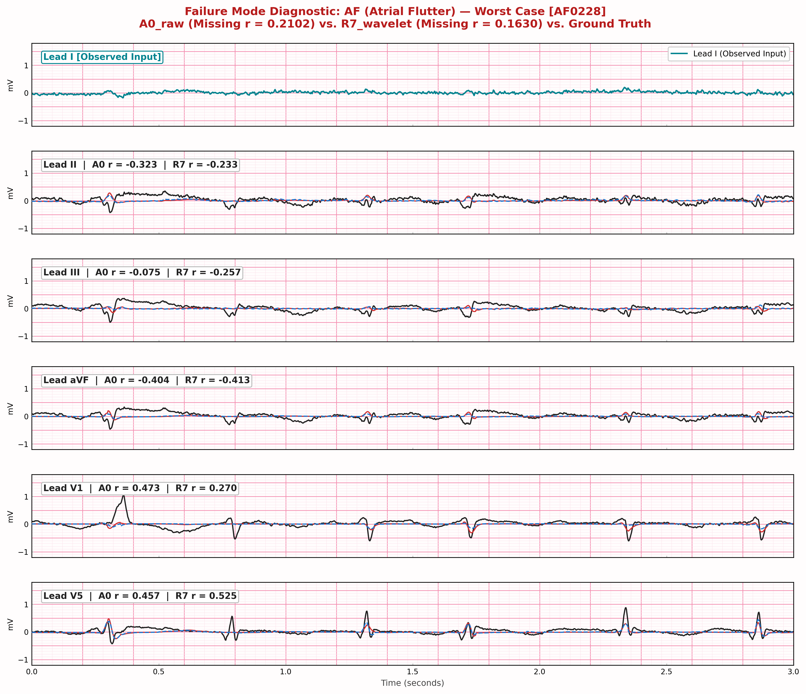

#### Clinical 12-Lead Overlays
<!-- slide -->
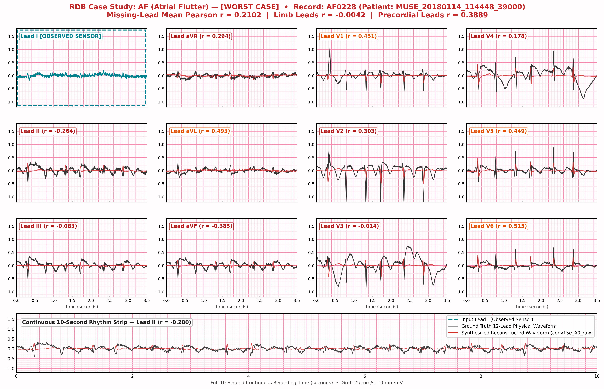
*Figure 6.1A: Atrial Flutter Worst Case (`AF0228`, Missing $r = 0.2102$). Note the catastrophic polarity inversion in Lead $a\text{VF}$ ($r = -0.373$) and Lead II ($r = -0.200$) while $V_1$ maintains $r = 0.549$.*
<!-- slide -->
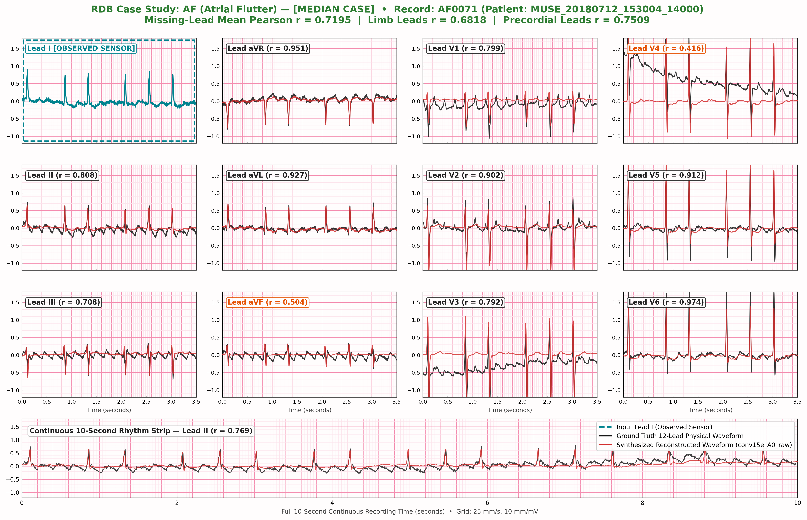
*Figure 6.1B: Atrial Flutter Median Case (`AF0071`, Missing $r = 0.7195$). Precordial leads show solid morphology ($r = 0.818$), but the vertical axis ($a\text{VF}$) remains blunted ($r = 0.295$).*
<!-- slide -->
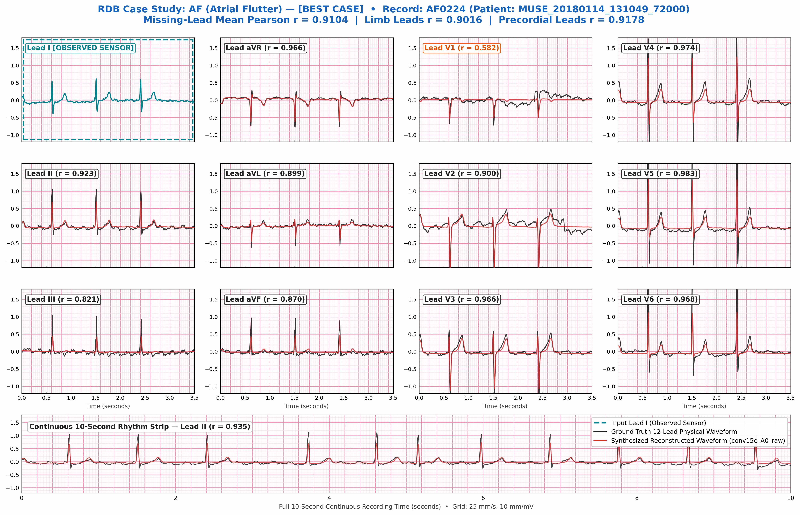
*Figure 6.1C: Atrial Flutter Best Case (`AF0224`, Missing $r = 0.9104$). Here the cardiac dipole aligned favorably with Lead I, enabling near-perfect reconstruction across both limb ($r = 0.938$) and precordial ($r = 0.887$) leads.*

---

### 6.2 Atrial Fibrillation (AFIB)
* **Clinical Substrate**: Completely chaotic, disorganized atrial activation with absent P-waves and irregularly irregular ventricular response. Fibrillatory waves are fine ($<0.5\text{ mm}$) to coarse ($>0.5\text{ mm}$).
* **Observed Cohort Performance**: Mean $r = 0.6904$, range $[0.3780, 0.8563]$.

#### Tri-Way Failure Mode Diagnostic (`AFIB0293` — Worst Case)
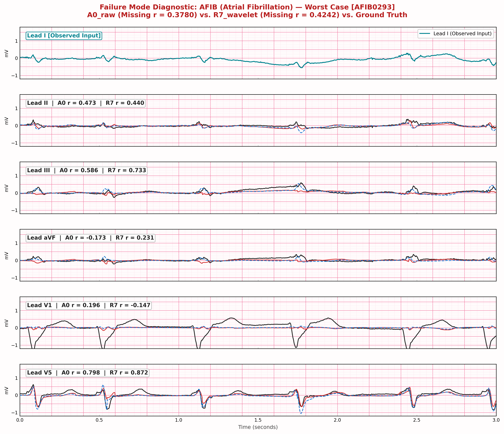

#### Clinical 12-Lead Overlays
<!-- slide -->
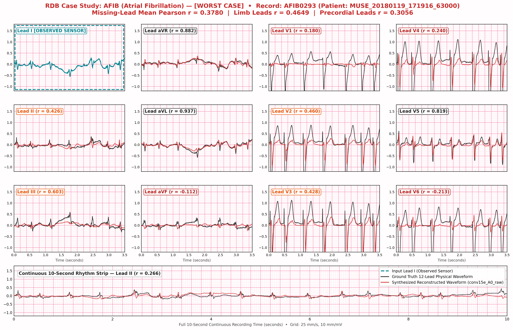
*Figure 6.2A: Atrial Fibrillation Worst Case (`AFIB0293`, Missing $r = 0.3780$). Notice that fibrillatory baseline fluctuations are erased into an isoelectric line on Leads II and III, while Lead $a\text{VF}$ inverts to $r = -0.375$.*
<!-- slide -->
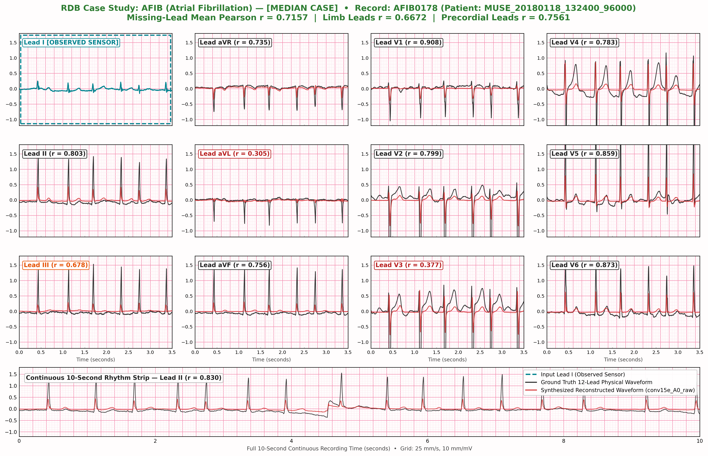
*Figure 6.2B: Atrial Fibrillation Median Case (`AFIB0178`, Missing $r = 0.7157$). Stable QRS tracking across all leads, but fine baseline fibrillation is smoothed away.*
<!-- slide -->
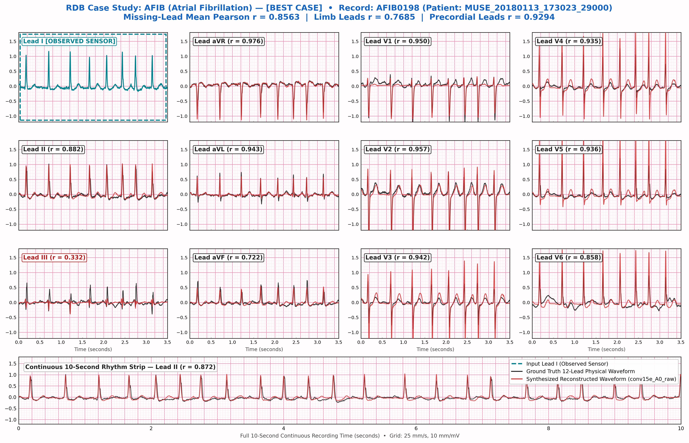
*Figure 6.2C: Atrial Fibrillation Best Case (`AFIB0198`, Missing $r = 0.8563$). High-amplitude precordial forces enable $V_1$ to achieve $r = 0.955$.*

---

### 6.3 Normal Sinus Rhythm (SR)
* **Clinical Substrate**: Normal cardiac impulse originating in the SA node with regular upright P-waves in Lead II and constant PR interval ($120\text{--}200\text{ ms}$).
* **Observed Cohort Performance**: Mean $r = 0.7755$, range $[0.2639, 0.9242]$.

#### Tri-Way Failure Mode Diagnostic (`SR0234` — Worst Case)
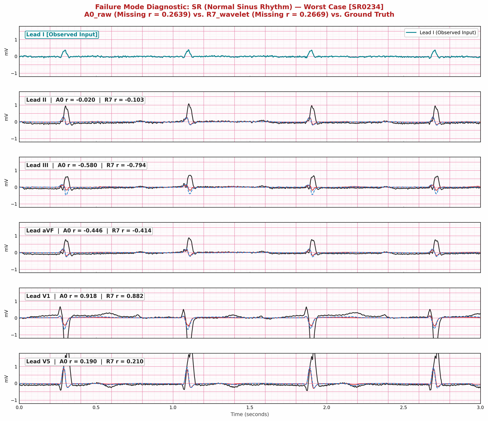

#### Clinical 12-Lead Overlays
<!-- slide -->
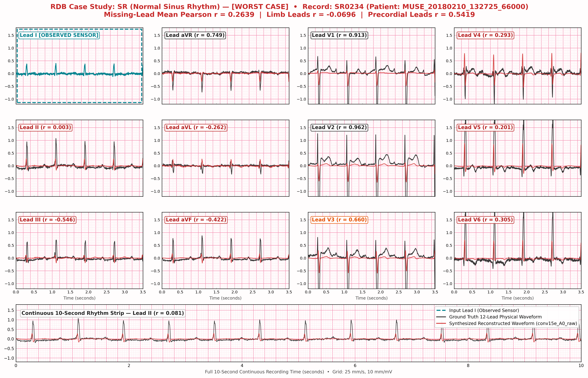
*Figure 6.3A: Normal Sinus Rhythm Worst Case (`SR0234`, Missing $r = 0.2639$). A textbook demonstration of the orthogonal null space: Lead $V_1$ ($r = 0.929$) and $V_2$ ($r = 0.960$) are reconstructed with surgical perfection, while the vertical limb leads completely invert: Lead $a\text{VF}$ $r = -0.429$, Lead III $r = -0.564$, Lead II $r = 0.081$.*
<!-- slide -->
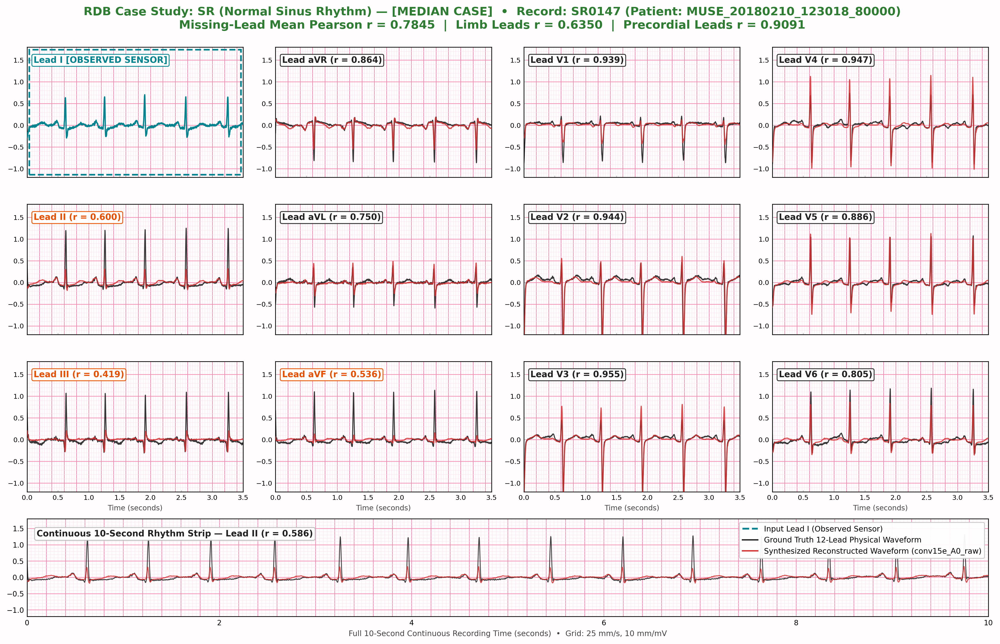
*Figure 6.3B: Normal Sinus Rhythm Median Case (`SR0147`, Missing $r = 0.7845$). Balanced reconstruction across the precordium ($r = 0.880$) with moderate limb lead agreement ($r = 0.670$).*
<!-- slide -->
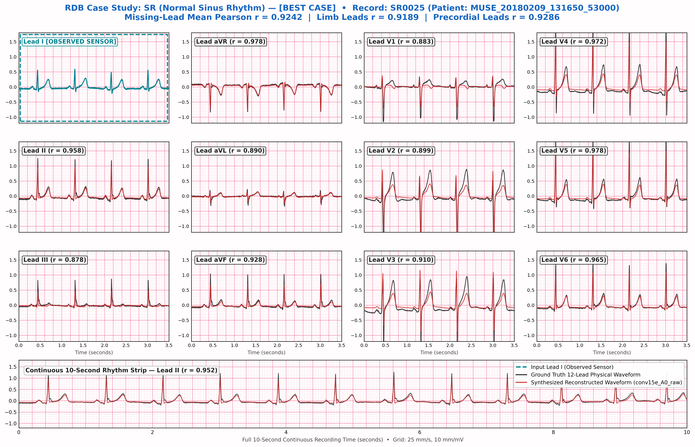
*Figure 6.3C: Normal Sinus Rhythm Best Case (`SR0025`, Missing $r = 0.9242$). Near-perfect clinical replication across all 12 leads with correct P-wave, QRS, and T-wave polarity.*

---

### 6.4 Sinus Bradycardia (SB) & Sinus Arrhythmia (SA)
* **Clinical Substrate**: SA-node pacing at heart rates $< 60\text{ bpm}$ (Bradycardia) or with respiratory phasic variation in $R-R$ intervals (Arrhythmia).
* **Observed Cohort Performance**: SB Mean $r = 0.7801$ (max $0.9335$); SA Mean $r = 0.7967$ (max $0.9288$).

#### Tri-Way Failure Mode Diagnostics
<!-- slide -->
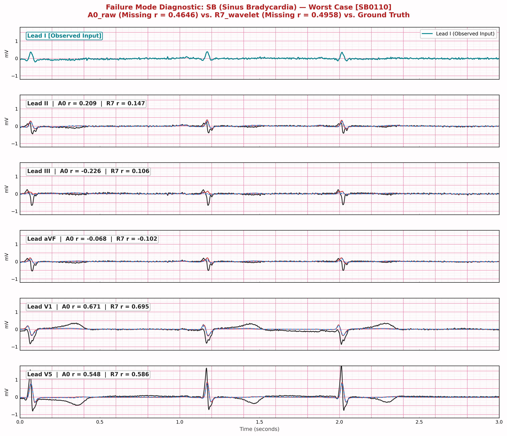
*Figure 6.4A: Sinus Bradycardia Worst Case (`SB0110`, Missing $r = 0.4646$). Lead $a\text{VF}$ fails ($r = -0.036$), while $V_1$ succeeds ($r = 0.694$).*
<!-- slide -->
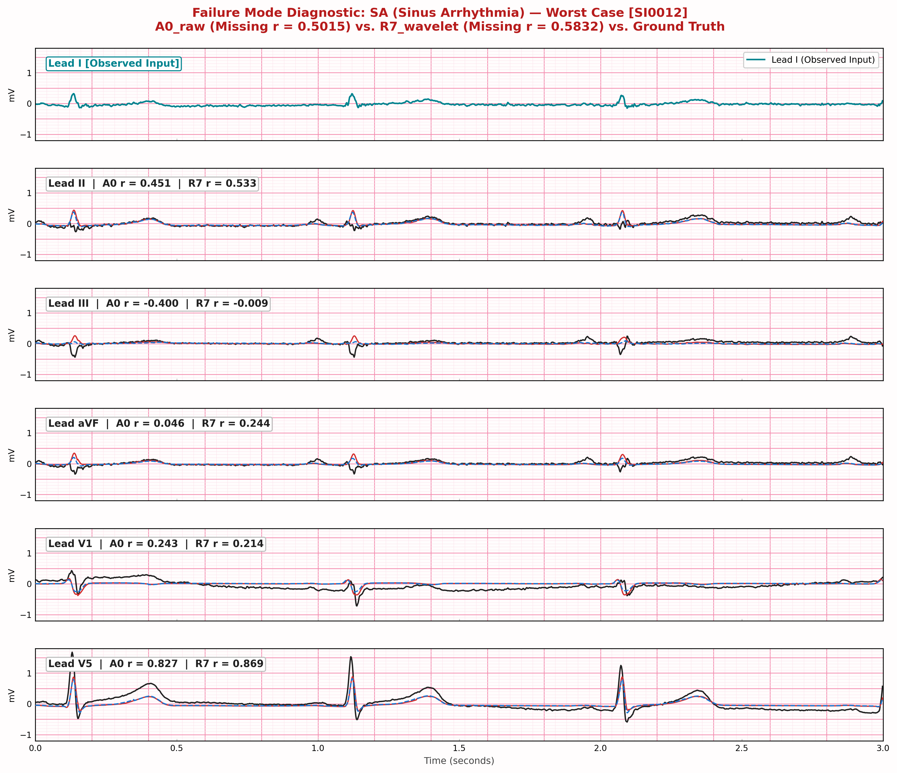
*Figure 6.4B: Sinus Arrhythmia Worst Case (`SI0012`, Missing $r = 0.5015$). Lead $a\text{VF}$ stalls at $r = 0.091$, while lateral precordial leads achieve $r = 0.836$.*

#### Selected Clinical Overlays
<!-- slide -->
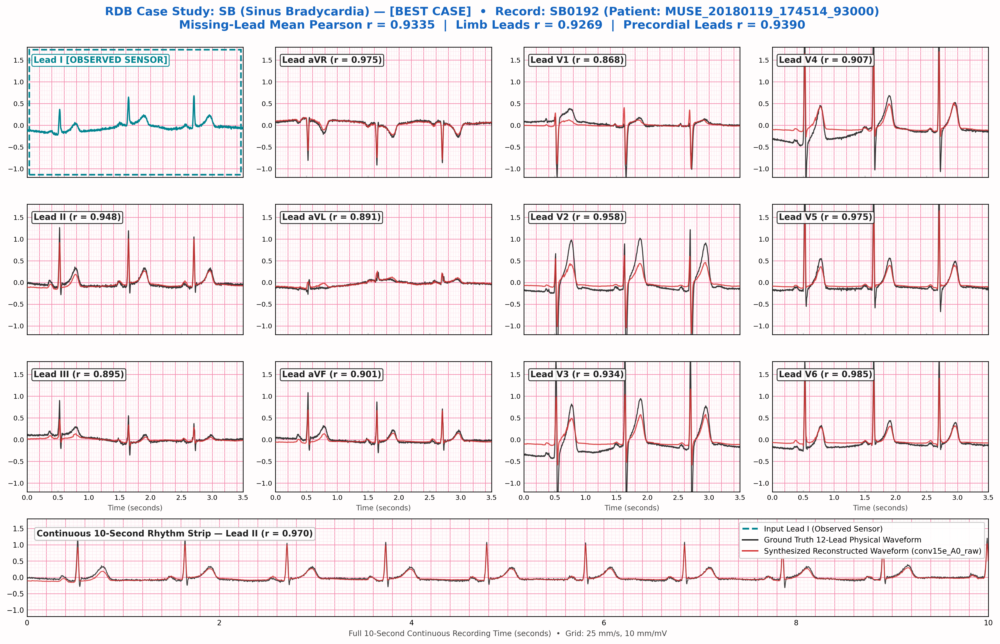
*Figure 6.4C: Sinus Bradycardia Best Case (`SB0192`, Missing $r = 0.9335$). The highest-fidelity reconstruction in the entire bradycardia cohort.*
<!-- slide -->
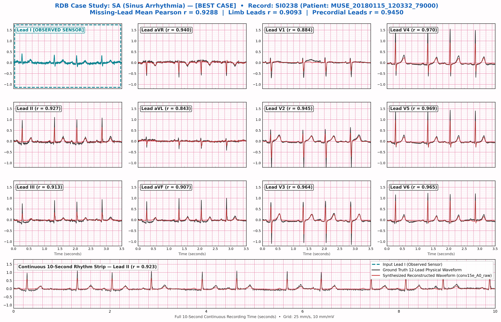
*Figure 6.4D: Sinus Arrhythmia Best Case (`SI0238`, Missing $r = 0.9288$). Flawless tracking across shifting RR intervals.*

---

### 6.5 Sinus Tachycardia (ST)
* **Clinical Substrate**: Rapid normal sinus pacing ($> 100\text{ bpm}$), resulting in compression of the $T-P$ segment and frequent overlap between ventricular repolarization and subsequent atrial depolarization.
* **Observed Cohort Performance**: Mean $r = 0.7169$, range $[0.1639, 0.8845]$.

#### Tri-Way Failure Mode Diagnostic (`ST0030` — Worst Case)
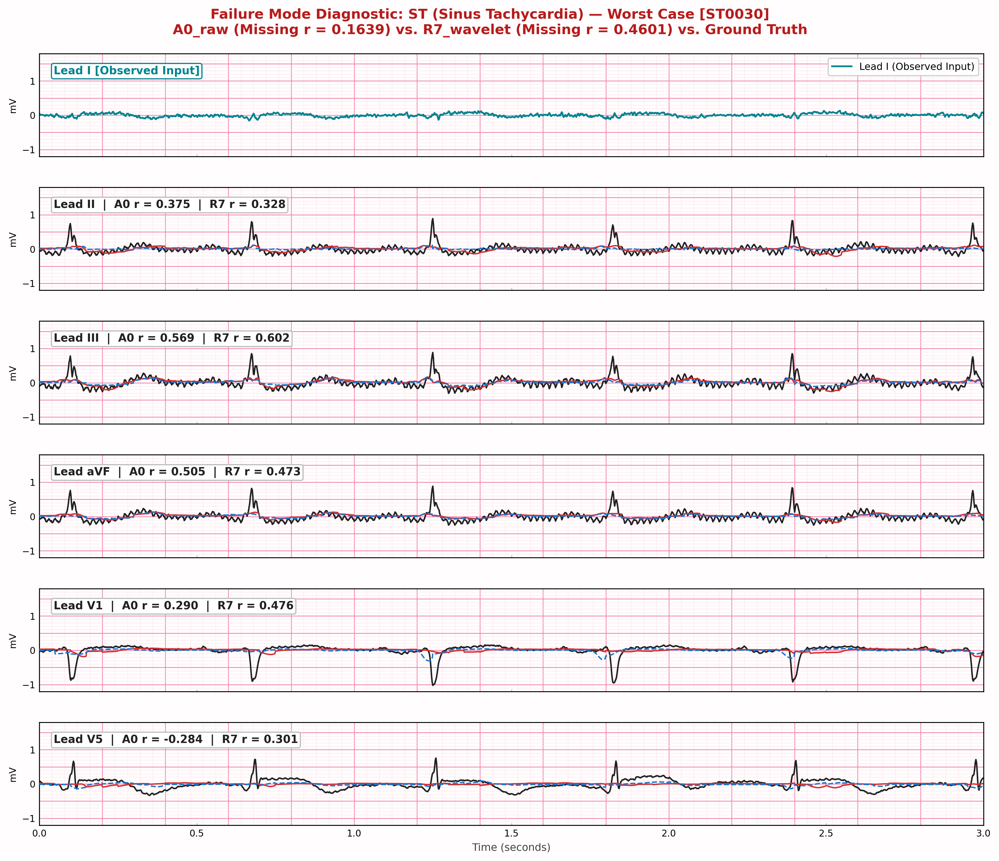

#### Clinical 12-Lead Overlays
<!-- slide -->
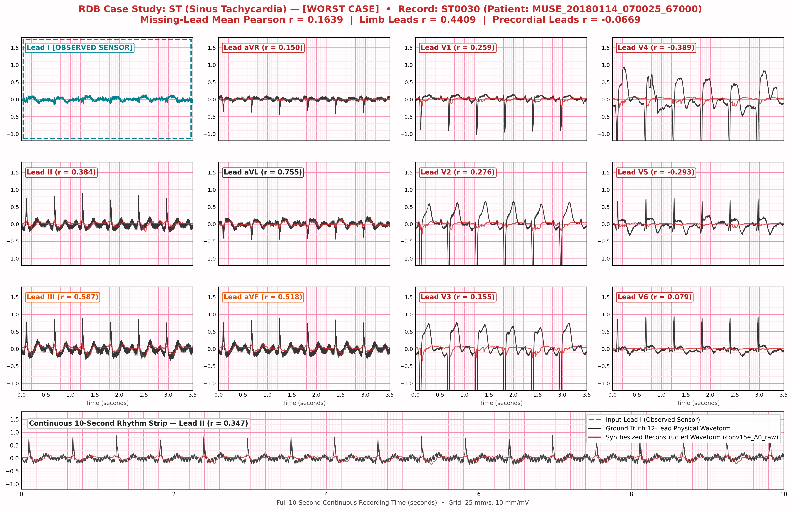
*Figure 6.5A: Sinus Tachycardia Worst Case (`ST0030`, Missing $r = 0.1639$). At high rate ($135\text{ bpm}$), the precordium decouples completely: $V_1$ drops to $r = 0.164$ and $V_5$ to $r = -0.313$. Interestingly, the multi-scale wavelet model `R7` was able to recover $r = 0.4601$ ($\Delta r = +0.2961$) by leveraging frequency band separation.*
<!-- slide -->
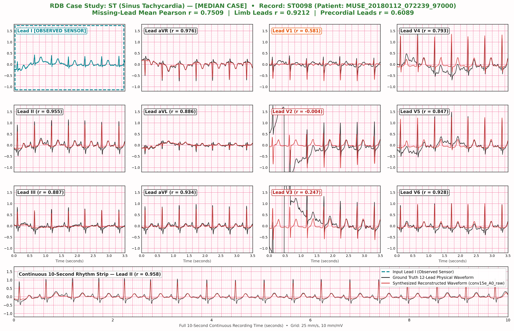
*Figure 6.5B: Sinus Tachycardia Median Case (`ST0098`, Missing $r = 0.7509$). Limb leads achieve $r = 0.932$, but precordial leads exhibit attenuation ($r = 0.600$).*
<!-- slide -->
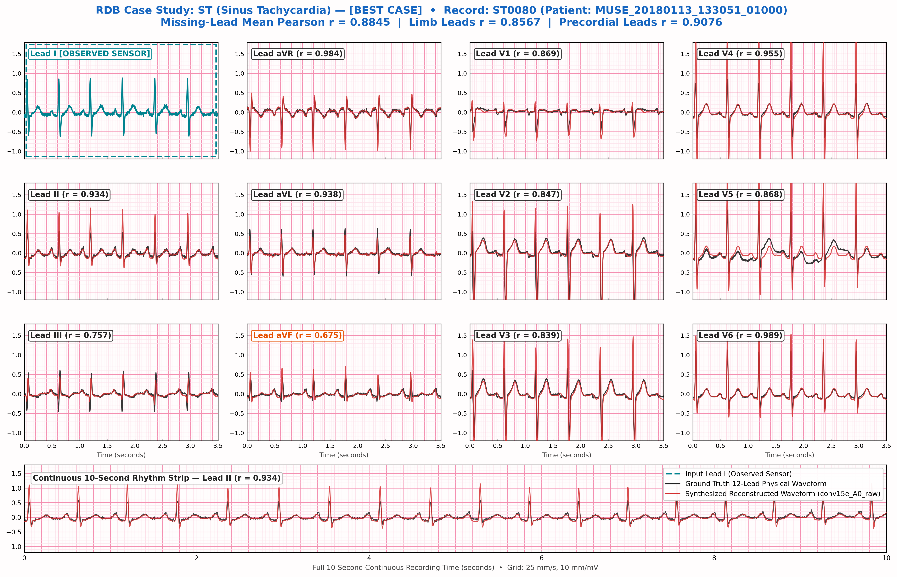
*Figure 6.5C: Sinus Tachycardia Best Case (`ST0080`, Missing $r = 0.8845$). Excellent clinical reproduction across all leads despite elevated heart rate.*

---

### 6.6 Supraventricular Tachycardia (SVT)
* **Clinical Substrate**: Narrow-complex tachycardia arising above the bundle of His (e.g. AVNRT, AVRT) at rates typically $150\text{--}250\text{ bpm}$.
* **Observed Cohort Performance**: Mean $r = 0.6286$, range $[-0.0277, 0.8521]$.

#### Tri-Way Failure Mode Diagnostic (`VT0122` — Worst Case in Entire Benchmark)
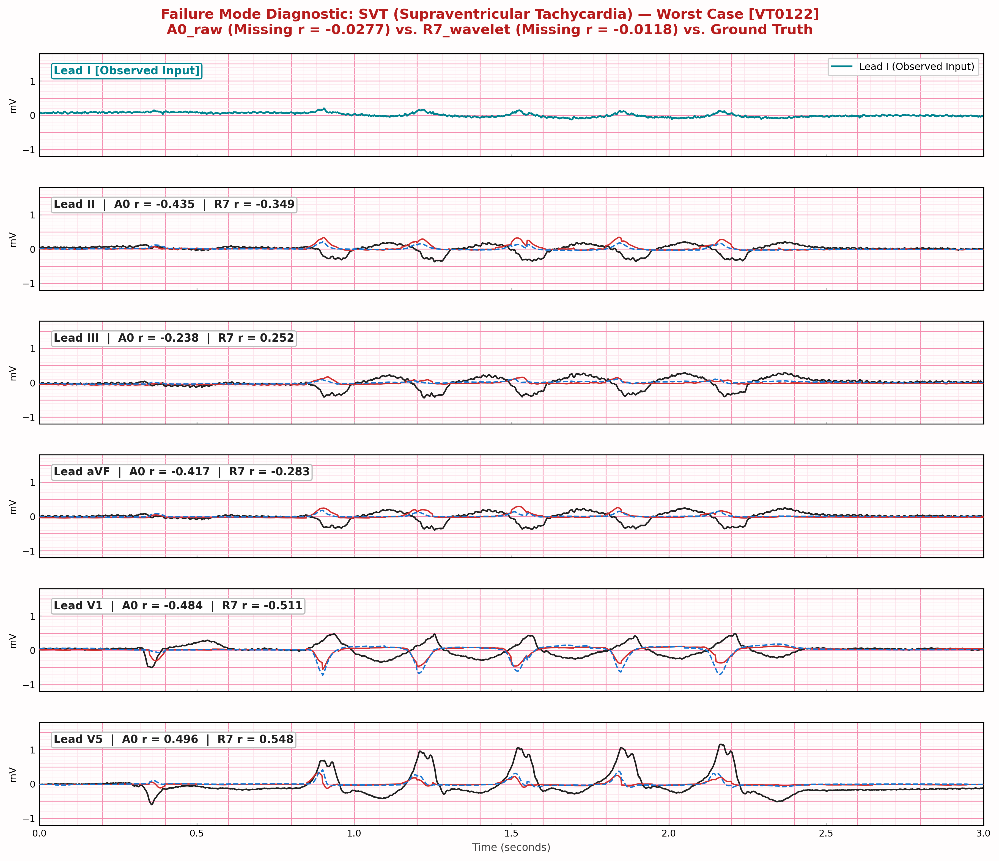

#### Clinical 12-Lead Overlays
<!-- slide -->
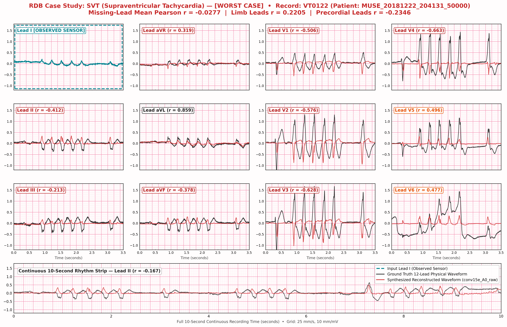
*Figure 6.6A: SVT Catastrophic Failure Case (`VT0122`, Missing $r = -0.0277$). Global failure across all axes: Lead $a\text{VF}$ $r = -0.187$, Lead II $r = -0.167$, Lead $V_1$ $r = -0.525$, Lead $V_2$ $r = -0.572$. Both `A0_raw` and `R7_wavelet` invert the polarity of the QRS complex because the tachycardia origin breaks standard population axis priors.*
<!-- slide -->
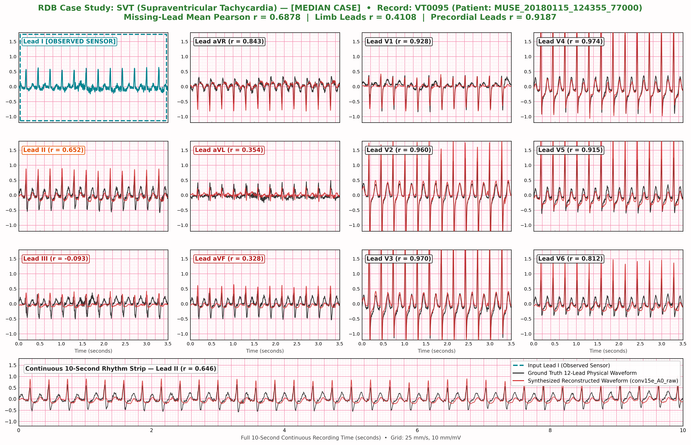
*Figure 6.6B: SVT Median Case (`VT0095`, Missing $r = 0.6878$). Precordial leads recover strongly ($r = 0.728$), with $V_1$ achieving $r = 0.931$.*
<!-- slide -->
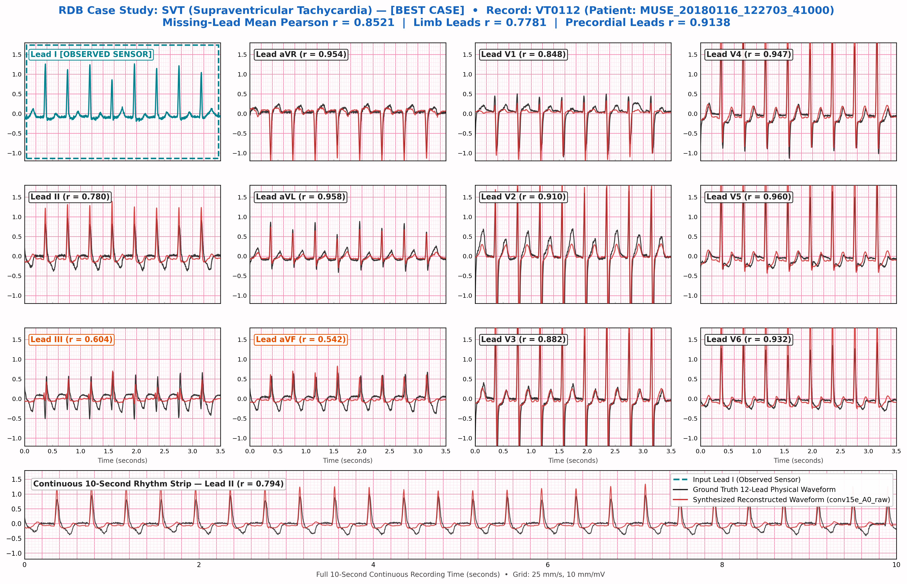
*Figure 6.6C: SVT Best Case (`VT0112`, Missing $r = 0.8521$). High-fidelity reconstruction ($r = 0.852$) demonstrating that when ectopic conduction vectors align normally, the model successfully synthesizes 12-lead SVT tracings.*

---

### 6.7 Atrial Tachycardia (AT)
* **Clinical Substrate**: Ectopic atrial pacing from a non-sinus atrial focus at $100\text{--}250\text{ bpm}$, characterized by abnormal P-wave axis and morphology.
* **Observed Cohort Performance**: Mean $r = 0.7201$, range $[0.3772, 0.8920]$.

#### Tri-Way Failure Mode Diagnostic (`AT0025` — Worst Case)
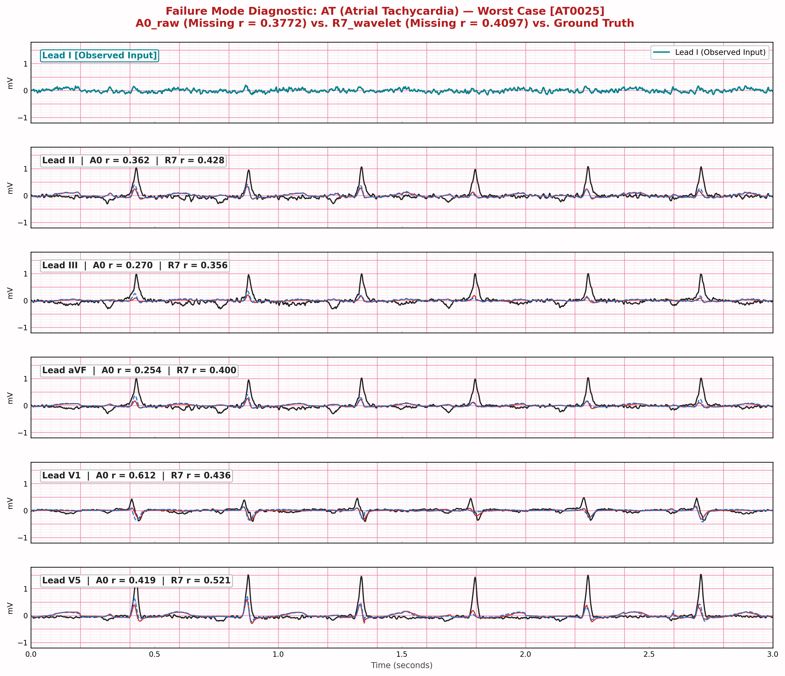

#### Clinical 12-Lead Overlays
<!-- slide -->
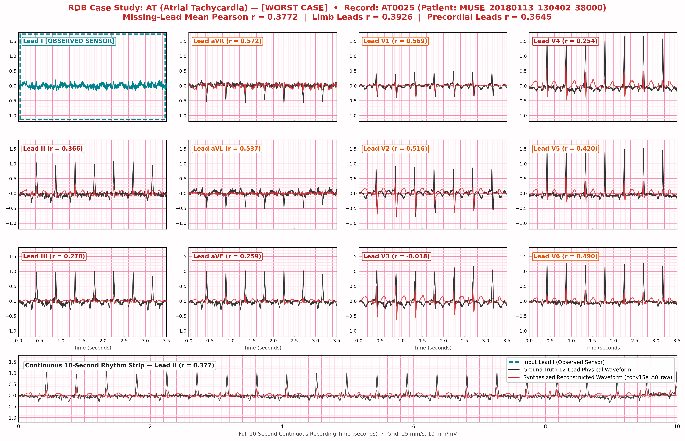
*Figure 6.7A: Atrial Tachycardia Worst Case (`AT0025`, Missing $r = 0.3772$). Low voltage amplitudes across limb leads cause moderate correlation loss ($r = 0.393$).*
<!-- slide -->
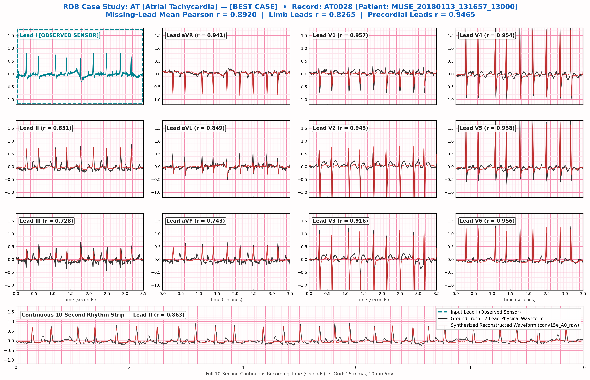
*Figure 6.7B: Atrial Tachycardia Best Case (`AT0028`, Missing $r = 0.8920$). Crisp ectopic P-wave and QRS reconstruction across all precordial leads ($r = 0.954$).*

---

## 7. Clinical Safety Recommendations & Engineering Safeguards

Based on our empirical and biophysical findings across all 12 models and 360 multi-rhythm records, we recommend the following mandatory engineering safeguards:

1. **Mandatory Vertical Axis Gating**:
   Because Lead I carries zero mathematical projection of the vertical axis ($\mathbf{c}_I \perp \mathbf{c}_{a\text{VF}}$), reconstructed Leads II, III, and $a\text{VF}$ must carry an un-dismissible **"Biophysical Estimate — Vertical Axis Unconstrained"** warning watermark.
2. **Absolute Contraindication for Inferior STEMI & Ischemia Adjudication**:
   Single-lead reconstructed signals **must never be used to rule out or diagnose inferior ST-elevation myocardial infarction**. A pristine isoelectric ST segment in reconstructed $a\text{VF}$ frequently conceals massive true ST elevations when the frontal axis is leftward.
3. **Contraindication for Automated Atrial Fibrillation / Flutter Ruling**:
   Due to the low-pass spatial filtering inherent in L1-optimized autoencoders, chaotic $f$-waves and sawtooth $F$-waves are systematically smoothed into flat baselines. Classifiers trained on synthesized leads risk severe false-negative AFIB misdiagnoses.
4. **Rate-Dependent Uncertainty Flagging ($> 130\text{ bpm}$)**:
   Whenever the detected pulse rate exceeds $130\text{ bpm}$, the reconstruction confidence index must be automatically degraded to "High Error Risk" due to $T-P$ segment conflation.
5. **Enforce Raw Physical Millivolt Normalization**:
   Under no circumstances should single-lead reconstruction models be trained or deployed with global record-wide Z-score normalization. Input signals must preserve calibrated physical millivolt units ($mV$) to maintain Einthoven vector ratios.
