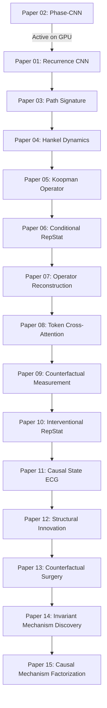

# Experiment Plan: Unified 15-Paper Scientific Validation Protocol

## 1. Experimental Setup & Datasets

### 1.1 In-Distribution Development & Evaluation
*   **Primary Development Benchmark**: PTB-XL (21,799 12-lead clinical ECGs, 5 superclasses: NORM, MI, STTC, CD, HYP).
*   **Data Partitioning**: Strict patient-stratified split (10-fold PTB-XL protocol): folds 1–8 for training, fold 9 for validation/early stopping, fold 10 for held-out evaluation.
*   **Representation Input**: Precomputed 16 phase cells per beat $\times$ 128 Nyström kernel features (`[Batch, 16, 128]`).

### 1.2 Out-of-Distribution (OOD) External Datasets (9 Total)
To evaluate universal generalization across recording equipment, geographic populations, and sampling rates:
1.  **PTB-XL** (Germany, 500Hz, Schiller AG)
2.  **EchoNext** (Multi-center echocardiogram-paired cohort)
3.  **LUDB** (Lobachevsky University, delineated rhythm annotations)
4.  **RDB** (Restored Wavelet Delineation Cache)
5.  **ISP** (In-hospital telemetry and stress testing)
6.  **Kingston-ICU** (Intensive care telemetry, acute critical patients)
7.  **Emory-MUSE** (North American clinical repository, GE Healthcare)
8.  **Sunnybrook** (Canadian ambulatory cohort)
9.  **Zhejiang** (Chinese multi-lead hospital repository)

---

## 2. Shared Hyperparameter Grid & Evaluation Protocol

For every paper and every architectural variant, we execute an exhaustive, standardized $3 \times 3$ grid:
*   **Learning Rates**: `1e-4`, `3e-4`, `1e-3`
*   **Weight Decays**: `1e-5`, `1e-4`, `1e-3`
*   **Optimizer**: AdamW with Cosine Annealing learning rate schedule.
*   **Batch Size**: 2048 (maximizes GPU throughput on A100).
*   **Epochs & Early Stopping**: Max 100 epochs, early stopping patience = 10 epochs on validation macro AUROC.
*   **Precision & Streams**: BF16 mixed precision, shared-tensor single-process CUDA streams.

### Shared Model Variants per Paper (Falsification Controls)
1.  `kernel`: True RKHS Nyström Kernel Mean Embedding (`[Batch, 16, 128]`).
2.  `moments`: Control baseline matching mean and variance of physical voltage (`[Batch, 16, 16]`).
3.  `gaussian`: Gaussian parametric distribution baseline (`[Batch, 16, 32]`).
4.  `linear`: Naive linear projection of physical phase voltages (`[Batch, 16, 16]`).

---

## 3. Paper-by-Paper Execution Order & Decision Gates

### Stage Decision Gates
*   **Gate 1 (Representational Validity, Papers 01–03)**: `kernel` variant must achieve $\ge 0.85$ Macro AUROC on PTB-XL and beat all moment controls by $>0.02$. (Paper 02 has already passed this gate: 0.8716 AUROC).
*   **Gate 2 (Dynamical Linearity, Papers 04–05)**: Koopman linear forward operator error must remain $<0.05$ relative MSE across 3-beat projection.
*   **Gate 3 (Biophysical Retention, Papers 06–08)**: Paper 07 reconstruction head must achieve physical waveform correlation $r \ge 0.90$ while maintaining $\ge 0.86$ diagnostic AUROC.
*   **Gate 4 (Causal & Invariant Generalization, Papers 09–15)**: OOD degradation across the 9 external datasets must be reduced by $\ge 30\%$ compared to standard ERM.

---

## 4. Compute Budget & Monitoring
*   **GPU**: 1x NVIDIA A100-SXM4-40GB / 80GB
*   **VRAM per Cell**: $0.4$ – $1.2$ GiB (utilizing parallel streams across all 9 cells).
*   **Runtime per Paper**: 15 – 25 minutes.
*   **Total Suite Runtime**: ~4.5 hours.
*   **Logging & Artifacts**: Every run automatically saves `summary.json`, `predictions.npz`, `checkpoint.pt`, and registers to `metrics.csv`.
