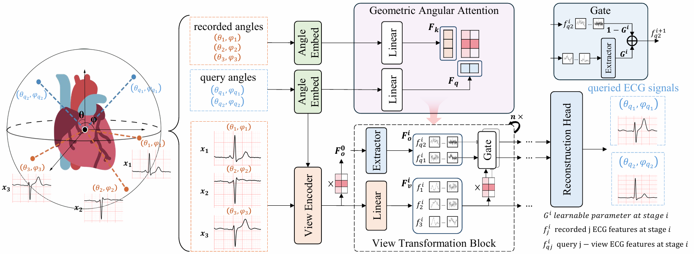
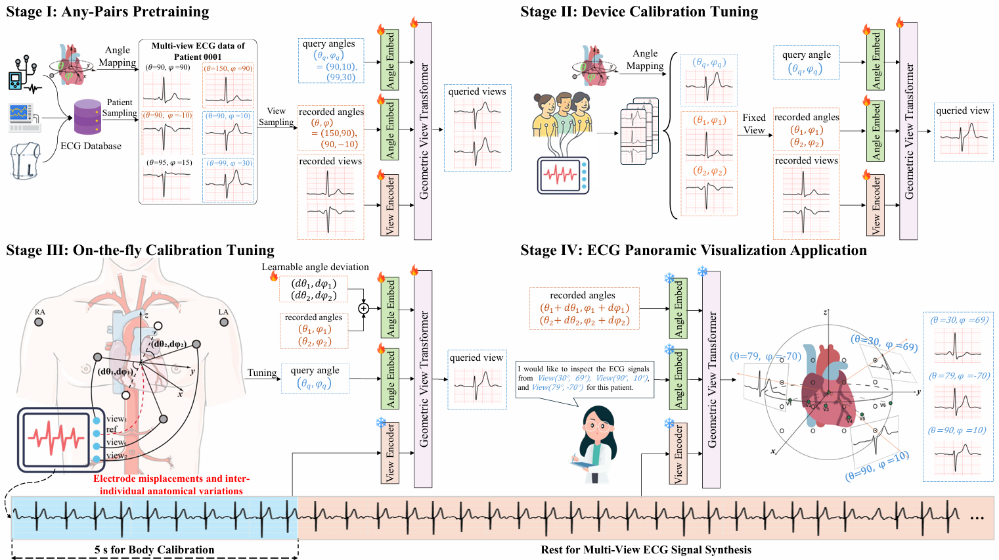
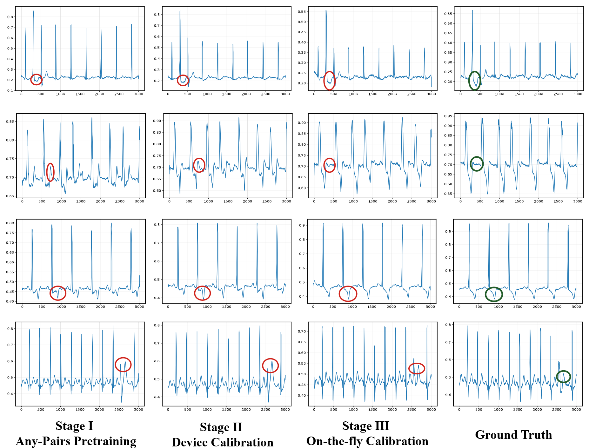

# Nef-Net v2: Adapting Electrocardio Panorama in the Wild

<p align="center">
  <a href="https://arxiv.org/abs/2511.02880">
    
  </a>
  <a href="https://openreview.net/forum?id=JzZhhhxniR">
    
  </a>
</p>

This repository contains the official implementation and datasets for our ICLR 2026 paper:

> **Nef-Net v2: Adapting Electrocardio Panorama in the Wild**

- **Paper:** [arXiv](https://arxiv.org/pdf/2511.02880)
- **OpenReview:** [ICLR 2026](https://openreview.net/forum?id=JzZhhhxniR)

---

## Overview

Electrocardiogram signals recorded from different leads can be regarded as observations of the same underlying cardiac electrical activity from different spatial viewpoints.

Although the standard 12-lead ECG is widely used in clinical practice, its fixed and limited lead configuration may fail to capture abnormalities that are visible only from specific directions. For example, posterior myocardial infarction may require additional posterior leads V7–V9, while Brugada syndrome may require V1–V2 to be placed at higher intercostal spaces to reveal characteristic patterns.

These examples indicate that clinically relevant ECG abnormalities can be strongly dependent on the observation viewpoint.

Electrocardio Panorama aims to overcome this limitation by synthesizing ECG signals from arbitrary virtual viewpoints using a limited number of recorded leads. Similar to multi-view imaging, nearby ECG viewpoints contain redundant information, whereas spatially diverse viewpoints provide complementary observations of cardiac electrical activity.

Nef-Net v2 formulates Electrocardio Panorama synthesis as a **direct view-to-view transformation problem**. Given recorded ECG signals, their corresponding spatial angles, and a target angle, the model generates the ECG signal that would be observed from the queried viewpoint.

---

## Nef-Net v2 Architecture

Nef-Net v2 consists of three main components:

1. **Angle Embedding**
2. **View Encoder**
3. **Geometric View Transformer**

The model takes the following inputs:

- recorded ECG signals;
- spatial angles of the recorded leads;
- spatial angle of the queried lead.

The output is the synthesized ECG signal corresponding to the queried viewpoint.

<p align="center">
  
</p>

The Angle Embedding module encodes the geometric positions of the recorded and queried leads. The View Encoder extracts query-relevant temporal features from each recorded ECG signal. The Geometric View Transformer then aggregates and transforms the recorded-view features according to their geometric relationships with the queried viewpoint.

---

## Development and Deployment Framework

The complete Nef-Net v2 workflow consists of three model-development stages followed by Electrocardio Panorama deployment.

<p align="center">
  
</p>

### Stage I: Any-Pairs Pretraining

The model is pretrained using dynamically sampled recorded-query lead pairs. This strategy enables Nef-Net v2 to learn general ECG morphology and cross-view transformation relationships from multiple datasets.

### Stage II: Device Calibration

The pretrained model is adapted to the target ECG acquisition device. This stage reduces distribution shifts caused by differences in hardware design, amplification, filtering, sampling, and preprocessing pipelines.

### Stage III: On-the-fly Calibration

A short ECG segment from each examination is used to estimate viewpoint deviations caused by electrode-placement errors and individual anatomical variability.

### Stage IV: Electrocardio Panorama Synthesis

After calibration, the model can synthesize ECG signals from arbitrary user-defined viewpoints.

---

## Qualitative Results

The following example illustrates how synthesized ECG signals progressively improve across the pretraining and calibration stages.

<p align="center">
  
</p>

The complete framework improves the preservation of clinically relevant ECG morphology by reducing device-level and subject-level distribution shifts.

---

## Repository Structure

```text
NEFNET-v2/
├── codes/                  # Training, calibration, and evaluation code
├── Figures/                # Figures used in the paper
├── requirements.txt        # Python dependencies
├── README.md
└── LICENSE
```

---

## Installation

### 1. Clone the repository

```bash
git clone https://github.com/HKUSTGZ-ML4Health-Lab/NEFNET-v2.git
cd NEFNET-v2
```

### 2. Create a Python environment

We recommend using Conda to create an isolated environment:

```bash
conda create -n nefnetv2 python=3.9 -y
conda activate nefnetv2
```

### 3. Install dependencies

```bash
pip install -r requirements.txt
```

Please ensure that the installed PyTorch version is compatible with your CUDA environment.

---

## Datasets

The experiments in Nef-Net v2 use the following ECG datasets:

| Dataset | Description | Access |
|---|---|---|
| Tianchi ECG | Public 12-lead ECG dataset | [Dataset](https://tianchi.aliyun.com/competition/entrance/231754/information) |
| PTB-XL | Large-scale clinical 12-lead ECG dataset | [Dataset](https://physionet.org/content/ptb-xl/) |
| CPSC2018 | ECG rhythm and morphology abnormality dataset | [Dataset](http://2018.icbeb.org/Challenge.html) |
| ChinaDB | Large-scale 12-lead ECG database | [Dataset](https://www.nature.com/articles/s41597-020-0386-x) |
| Panobench | Dense 48-view Electrocardio Panorama benchmark | [Dataset](https://huggingface.co/datasets/whynotJunger/Panobench) |

Please download each dataset from its official source and follow the corresponding license, citation, and data-use requirements.

The original ECG datasets remain subject to their respective licenses and policies. Users are responsible for complying with the terms of the original data providers.

---

## Data Preparation

ECG recordings from different datasets should be converted into a unified format before training.

The main preprocessing steps include:

1. resampling signals to a consistent sampling frequency;
2. normalizing ECG amplitudes;
3. organizing recorded and queried lead pairs;
4. assigning spatial coordinates to each ECG viewpoint;
5. dividing the data into training and testing sets.

---

## Usage

Enter the code directory:

```bash
cd codes
```

The complete workflow consists of the following steps:

```text
1. Data preprocessing
2. Any-Pairs Pretraining
3. Device Calibration
4. On-the-fly Calibration
5. ECG reconstruction and arbitrary-view synthesis
6. Performance evaluation
```

Please refer to the released scripts and configuration files for detailed commands and parameter settings.

---

## Evaluation

Nef-Net v2 is evaluated on two complementary tasks.

### View Reconstruction

The model reconstructs ECG signals from viewpoints included in the training distribution.

### Unseen-view Synthesis

The model synthesizes ECG signals from viewpoints that are not directly observed during training.

The primary signal-level evaluation metrics include:

- Peak Signal-to-Noise Ratio;
- Structural Similarity Index.

Additional analyses include:

- reconstruction and synthesis performance across different datasets;
- performance across different cardiac conditions;
- preservation of pathological ECG morphology;
- robustness to device-specific distribution shifts;
- robustness to electrode-placement deviations.

---

## Relationship to Previous Work

Nef-Net v2 is a continuation of:

> **Electrocardio Panorama: Synthesizing New ECG Views with Self-supervision**

The previous work introduced Electrocardio Panorama and modeled cardiac electrical activity using an implicit neural electrocardiac field, enabling ECG synthesis from arbitrary viewpoints.

---


## Citation

Please cite our paper if the code or dataset is useful in your research:

> ```
>@inproceedings{zhan2025nef,
> title={NEF-NET+: Adapting Electrocardio panorama in the wild},
> author={Zhan, Zehui and Hu, Yaojun and Zhan, Jiajing and Lian, Wanchen and Wu, Wanqing and Chen, Jintai},
> journal={arXiv preprint arXiv:2511.02880},
> year={2025}}

## License

The source code is released under the license provided in this repository.

The datasets used in this project are governed by their respective licenses. Users are responsible for complying with the terms and policies of the original data providers.

Panobench is intended for non-commercial academic use unless otherwise specified by its dataset license.

---

## Acknowledgements

We thank the maintainers of Tianchi ECG, PTB-XL, CPSC2018, and ChinaDB for making their ECG datasets available to the research community.

We also thank the participants and medical professionals who contributed to the collection and validation of Panobench.

---
