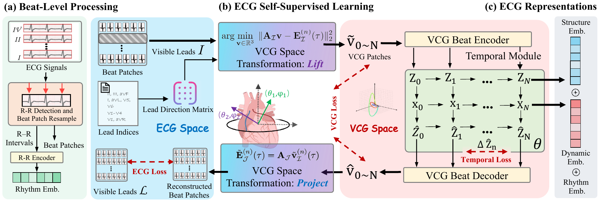

# LVCG

## Learning Cardiac Latent Representations in Vectorcardiogram Space

*ICML 2026 · Official PyTorch implementation*

**[🌐 Project Page](https://bosonhwang.github.io/LVCG-page/) · [📄 arXiv](https://arxiv.org/abs/2605.31249)**

<p align="center">
  
</p>

**LVCG** is the first general self-supervised framework for 12-lead ECG that learns in **latent vectorcardiogram (VCG) space** rather than raw lead signals. Because standard ECG is multiple linear views of the same cardiac field, lead-space learning entangles pathology with electrode geometry and generalizes poorly under domain shift; inspired by the Frank VCG model, LVCG instead recovers a unified 3D field and learns **view-invariant** representations via self-supervised multi-lead reconstruction—lifting visible leads, encoding beat morphology through a token bottleneck, modeling inter-beat dynamics, and projecting back to missing leads with a non-learnable geometry layer. This physically grounded design yields compact embeddings that transfer strongly to linear probing, multi-lead view reconstruction, and non-cardiac detection, especially with scarce labels and cross-site shift.

## Installation

```bash
conda create -n lvcg python=3.10
conda activate lvcg
pip install -e .
```

Requirements: PyTorch 2.x, NumPy, SciPy, PyYAML, WFDB (MIMIC loading), scikit-learn (probing), pandas (AI-READI).

## Data

PhysioNet datasets require [credentialed access](https://physionet.org/settings/credentialing/).

| Dataset | Role | Official link |
|---------|------|---------------|
| MIMIC-IV ECG | Pretraining | https://physionet.org/content/mimic-iv-ecg/1.0/ |
| PTB-XL | Probing (4 tasks) | https://physionet.org/content/ptb-xl/1.0.3/ |
| CPSC 2018 / ICBEB | Probing | https://physionet.org/content/challenge-2020/1.0.2/training/cpsc_2018/ |
| Chapman–Shaoxing (CSN) | Probing | https://physionet.org/content/ecg-arrhythmia/1.0.0/ |
| AI-READI | Probing (`cardio_relevant`) | https://aireadi.org/dataset · https://fairhub.io/datasets/1 |

**After download:** see [docs/DATA_PREPARATION.md](docs/DATA_PREPARATION.md) (manifest for MIMIC, folder layout for probing, and config paths).

## Training

LVCG pretraining on MIMIC-IV (self-supervised):

```bash
python scripts/train.py --config configs/train/lvcg_v5_gru.yaml
```

Checkpoints are written to `checkpoints/<run_id>/` (default run id `m5s1k1`). Use **`final.pt`** for downstream evaluation.

```bash
python scripts/train.py --config configs/train/lvcg_v5_gru.yaml \
  --data.meta_root /path/to/mimic_manifest.jsonl
```

## Evaluation

Linear probing on 7 datasets with **10% training labels** and **seed 42**:

```bash
python scripts/evaluate.py \
  --config configs/eval/probing.yaml \
  --checkpoint checkpoints/m5s1k1/final.pt
```

Results are appended to `probing/results/probing_results.csv`.

Single dataset:

```bash
python probing/run_probing.py --config configs/eval/probing.yaml \
  --models lvcg --dataset ptbxl_super_class --ratio 0.1 --seed 42
```

## Repository layout

```
lvcg/                 # Model, data pipeline, training utilities
scripts/              # train.py, evaluate.py, data helpers
configs/              # train and eval YAML
probing/              # Linear probing + data_splits/
docs/                 # DATA_PREPARATION.md, ARCHITECTURE.md
```

See [docs/ARCHITECTURE.md](docs/ARCHITECTURE.md) for the LVCG data flow and model design.

## Citation

If you use this code, please cite:

```bibtex
@inproceedings{huang2026lvcg,
  title     = {Learning Cardiac Latent Representations in Vectorcardiogram Space},
  author    = {Huang, Bosong and Zhao, Panzhen and Li, Zengxiang and Lee, Patricia
               and Jin, Wei and Liew, Alan Wee-Chung and Jin, Ming and Pan, Shirui},
  booktitle = {International Conference on Machine Learning (ICML)},
  year      = {2026}
}
```

## License

MIT — see [LICENSE](LICENSE).
