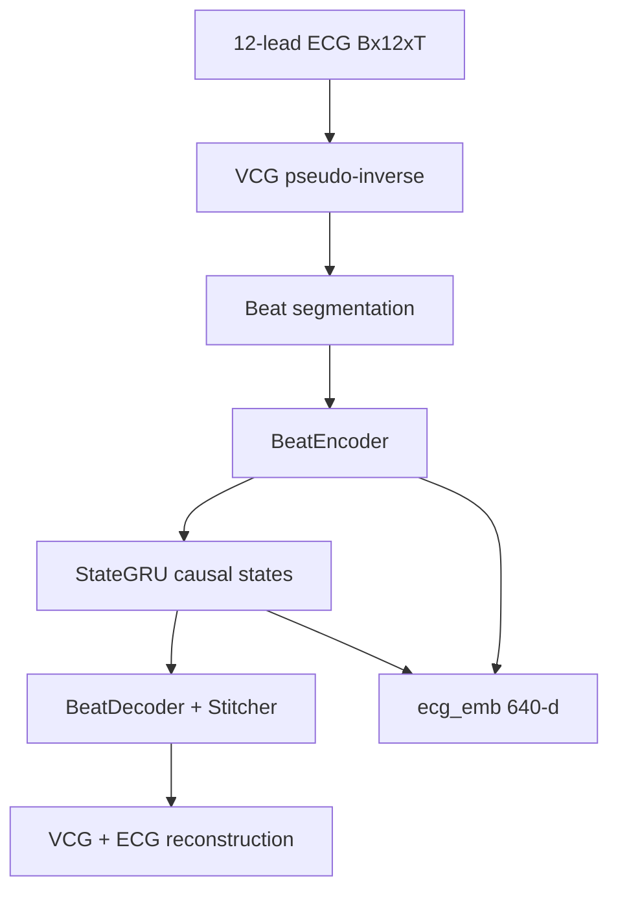

# LVCG architecture

Default release uses `use_ttt=false` with a causal **StateGRU** temporal module (`temporal_type=gru`).

## Data flow

## Embedding (640-d)

| Component | Dim | Source |
|-----------|-----|--------|
| `emb_struct` | 256 | First complete beat state (anchor beat) |
| `emb_dynamic` | 256 | StateGRU last hidden state |
| `emb_rhythm` | 128 | Global RR embedding |

Note: the paper describes structural embedding as mean-pooled beat tokens; this release uses the first complete beat as `emb_struct` for the shipped GRU baseline.

Downstream probing uses `LVCG.ext_ecg_emb()` via `probing/encoders/lvcg_encoder.py`.

## Losses (pretraining)

- **ECG reconstruction** (`L_ECG`): MSE on masked leads only (`num_visible=3`)
- **VCG beat** (`lambda_beat`): MSE on decoded vs geometry-recovered VCG patches
- **Temporal** (`lambda_temporal`): Huber loss on Δstate with stop-gradient on targets
- **Base beat** (`lambda_base`): anchor beat VCG reconstruction

Weights: `configs/train/lvcg_v5_gru.yaml`.

## Probing data

Benchmark splits live in `probing/data_splits/`; raw WFDB/MAT files are read from user `raw_root`. See [DATA_PREPARATION.md](DATA_PREPARATION.md).
